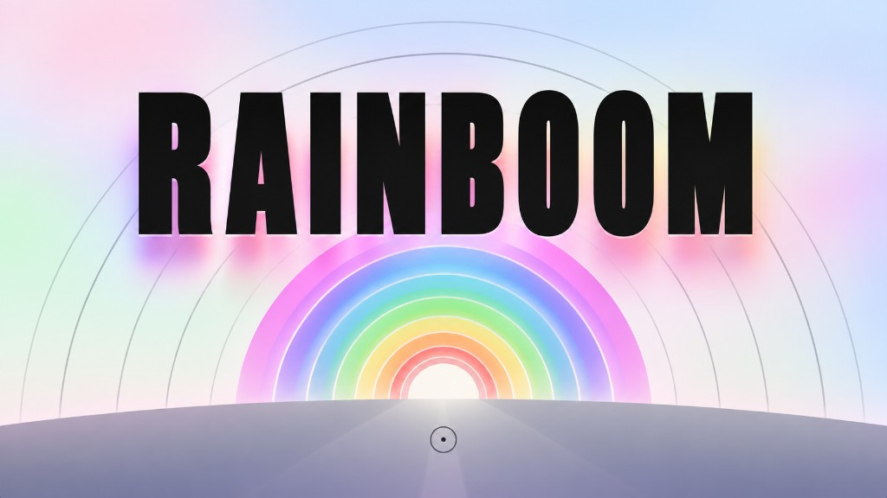

# RAINBOOM

Desktop and [WebXR](https://js13kgames.com/2026/webxr#libraries)
incremental game for [js13kGames 2026](https://js13kgames.com/2026).
You are a unicorn. Blast grey rainbows until they bloom, collect gold,
and spend it on a sky constellation that brings colour back.

A-Frame is loaded from the official js13k host and is **not** in the
13 KB zip. The zip is only our HTML, CSS, and game JS.

## Controls

**Desktop**
- Move the mouse to aim; hold click to blast
- Push the cursor to a screen edge, or use A / D / arrows, to look
- Aim at a skill node and fire to buy; aim at **GO** to start the next
  round

**WebXR**
- **ENTER XR** on the title screen (shown when a headset is available)
- Point with the controller (or look); pull trigger to blast and buy

## Stack

- Vanilla JS, one A-Frame scene, Three.js via A-Frame
- Official extra library:
  [`play.js13kgames.com/2026/webxr/aframe.js`](https://play.js13kgames.com/2026/webxr/aframe.js)
- Web Audio beeps (no samples)
- Optional [Wavedash](https://js13kgames.com/2026) host SDK (no-op if
  missing)
- Build: esbuild, Roadroller, Zopfli / ECT → `dist/game.zip`

```
npm start          # http://localhost:8080
npm run build      # zip, fail if over 13312 bytes
```

## Keeping the zip small

- A-Frame / Three stay on the js13k CDN; never bundled
- One `index.html` in the zip (inlined JS, stripped markup)
- esbuild minify + IIFE; Roadroller when it wins
- Zopfli DEFLATE, then ECT / advzip
- Packed integer skill defs; typed arrays for run state
- Shared Three geometries; canvas text instead of font files
- Procedural audio and meshes; no images, models, or webfonts
- Object pools (coins, rainbows); short names after minify
